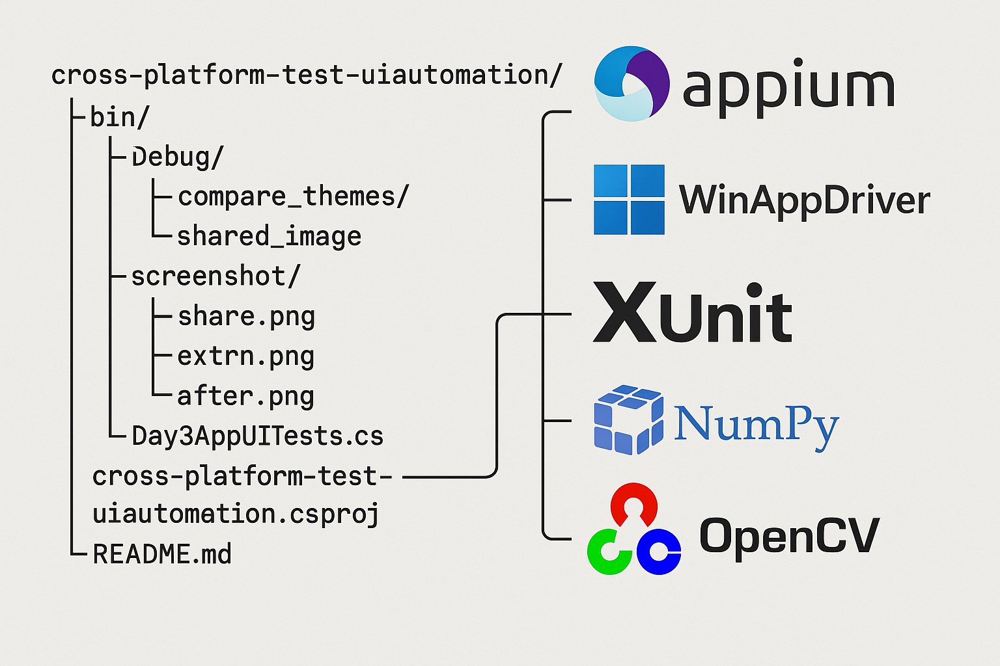

# Cross-Platform UI Automation Testing

This repository contains a C#-based cross-platform UI automation testing framework targeting desktop applications. It supports test development and executing using .NET and Appium's WinAppDriver.

## Features

- Automated UI interaction using WinAppDriver
- Test cases written in C# with xUnit support
- Screenshot comparison support (e.g., verifying if `share.png` contains `extron.png`)
- Organized project structure for easy test maintenance

## Project Structure

## Getting Started
### Prerequisites
- [.NET 8 SDK] (https://dotnet.microsoft.com/en-us/download/dotnet/8.0)
- [WinAppDriver] (https://github.com/microsoft/WinAppDriver)
- [Appium.WebDriver] From Nuget Solution, v4.3.1 (Do Not Use Latest v7.2.0)
- [xUnit] From Nuget Solution, v2.5.3
- [Python 3.x, Numpy and OpenCV] pip install numpy, opencv

## Run Tests
Open cross-platform-test-uiautomation.sln, run test or in the terminal and type in: dotnet test

## Screenshot Matching Logic (Python)
The script compares whether extron.png is included in share.png using OpenCV template matching and outputs the confidence score.

## License

MIT License.